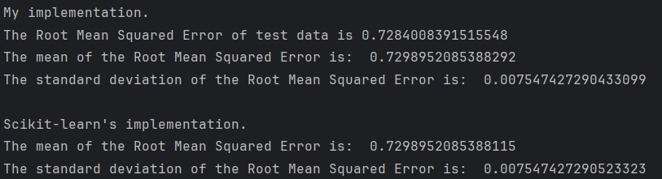

# linear-regression

##### This project is a very simple linear regression model using only NumPy. And a comparison to scikit-learn's built-in LinearRegression. The dataset used is the California Housing dataset.

## Requirements 
- python 3
- numpy
- scikit-learn

## How to run:
- First clone the repo
`git clone https://github.com/mariatsarouche/linear-regression.git`
`cd linear-regression`
- Download the requirements:
`pip install -r requirements.txt`
- Then run
`python test_lr.py`

## After running it'll show something like this:
